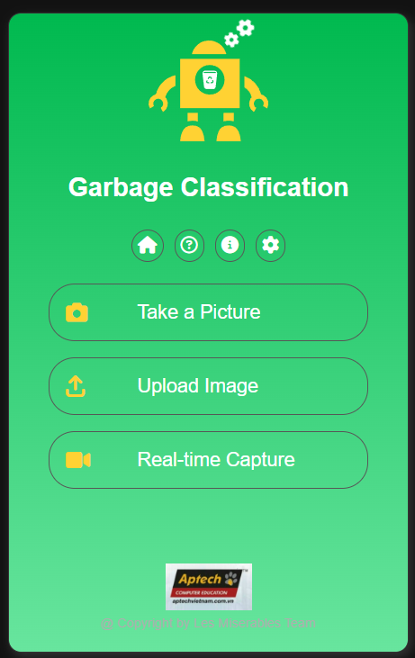
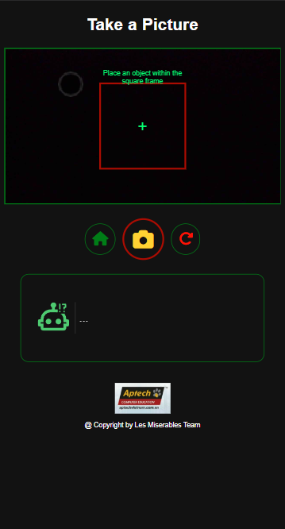

### B1. Add file
Add file model to \sources\app\models\files

### B2.Docker setup

    # Server build docker container
    docker build --no-cache -t prj_sem4 .

    # Run container
    # build trên server https://t1-trash-detective.click
    docker run -d --network=host -v /home/is_mpv/test_docker/test/app_test/project-test1:/sites/aptech-s4 prj_sem4
    # build dưới local
    docker run -d --network=host -v /home/is_mpv/test_docker/test/app_test/project-test1:/sites/aptech-s4 prj_sem4

    # Docker
    docker exec -it container_id /bin/bash

### B2.Window or Linux server

    # Requirements 
    - Flask==3.0.0
    #pip install -U Flask
    - tensorflow==2.14.0
    #pip install "tensorflow<2.14" 
    - pillow==8.4.0
    #pip install Pillow
    - pip install python-dotenv
    # pip install flask-login
    - flask-login

    # Run Flask
    - cd sources/
    - py run.py

### QR-code

### Result

### Classification from camera

